#LIRI-NODE-APPLICATION

## What you can do with the Liri Application

> Do you have a movie, song, concert, or artist you would like more information about.
> You can use the LIRI-NODE-APPLICATION to get this information. 
> Simply follow these steps:

### Looking For A Movie

> Open a terminal window and type the following:
> node liri.js movie-this *<enter your movie name here>* 

### Looking For A Concert

> Open a terminal window and type the following: 
> node liri.js concert-this *<enter your concert or artist name here>*

### Looking For a Song

> Open a terminal window and type the following: 
> node liri.js spotify-this-song *<enter your song here>*

You will see your results in the file called 'log.txt' as well as the terminal window.

### Using a file for your input

> If you do not want to provide the movie, song, artist, or concert you are looking 
for on the command line then you can simply add the selectionOption and the information
you are looking for in the file called 'random.txt'. 

Provide the information the following format:
<enter your selection option here>,<enter your movie, song, etc. here>

Example: spotify-this-song,To The Left

## Approach to Building the LIRI-NODE-APPLICATION

1) There are specific selections (commands) that the LIRI application will accept.
movie-this, spotify-this-song, concert-this, etc. First, I verified passing in the 
the argument (command) would invoke a specific function. I had a simple console.log 
in the function specifying which function was being called. 

2) Once I coded to ensure that the right function would be called given the selection
provided, I wrote the function for searching the movie. I passed in the 2nd argument which 
is used as the search criteria. I made the API using axios. I made sure that I could
console.log the information I needed. Once I had this information, I cocatenated the
information together and console.log the end results to the page.

3) I followed the same method for the other commands 'spotify-this-song' and 'concert-this'.

4) Once I created the functions for the commands and console logged this information to the terminal,
I began working on the 'do-what-it-says' feature. I parsed the information from the file and
set the variables (selection and searchItem) to the values from the file. I called the
function 'whatSelection' and allowed it to determine which function to call (movie, apotify, etc.).

5) My goal was to reuse code whenever possible during this assignment. 

6) My last step was to write the results to the log.txt file. 

## Application Flow

#### 1) Screenshot: Executing command 'movie-this' for the Movie 'Saw'

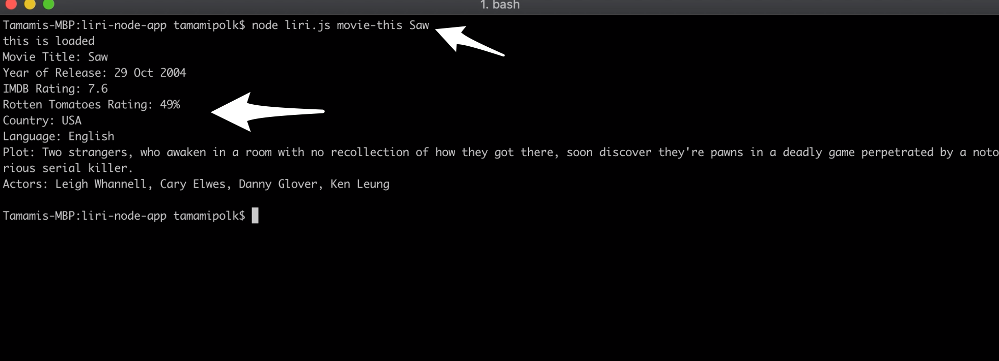

#### 2) Screenshot: Display the log file with the results of movie-this Saw

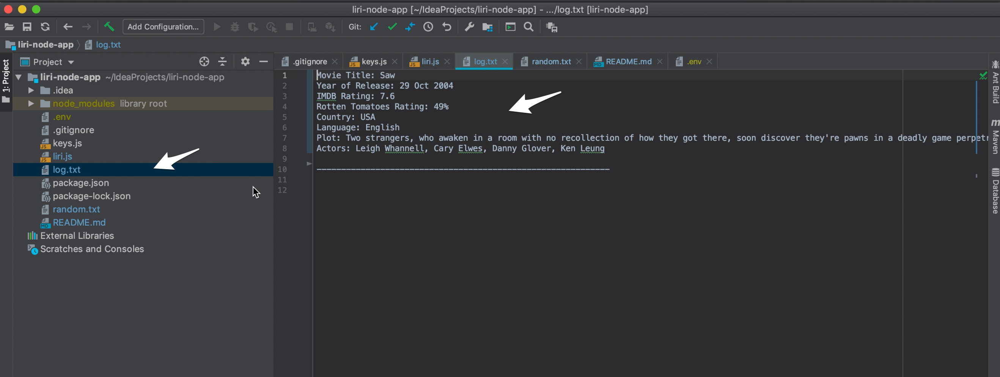

#### 3) Screenshot: Executing command 'spotify-this-song' for the Song Man In The Mirror

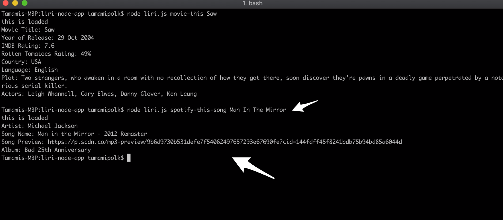

#### 4) Screenshot: Display the log file with the results of spotify-this-song

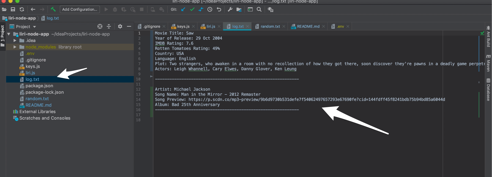

#### 5) Screenshot: Executing command 'concert-this-command' for Ariana Grande

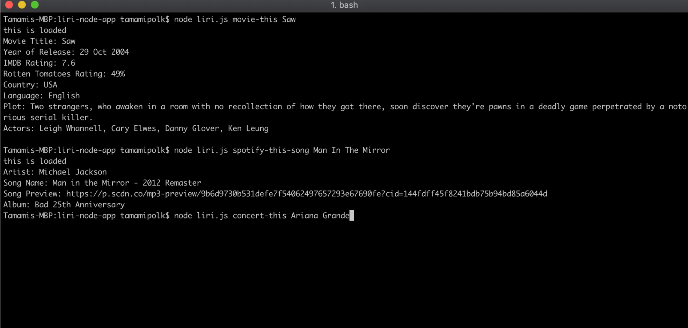

#### 6) Screenshot: Display the terminal with the results of concert-this

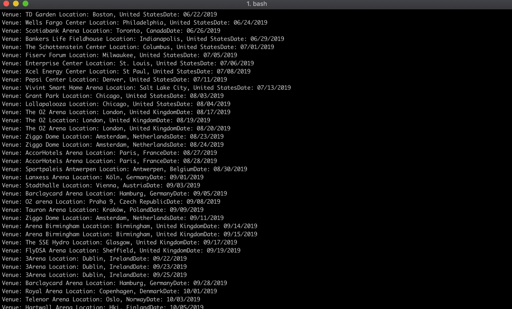

#### 7) Screenshot: Display the log file with the results of spotify-this-song

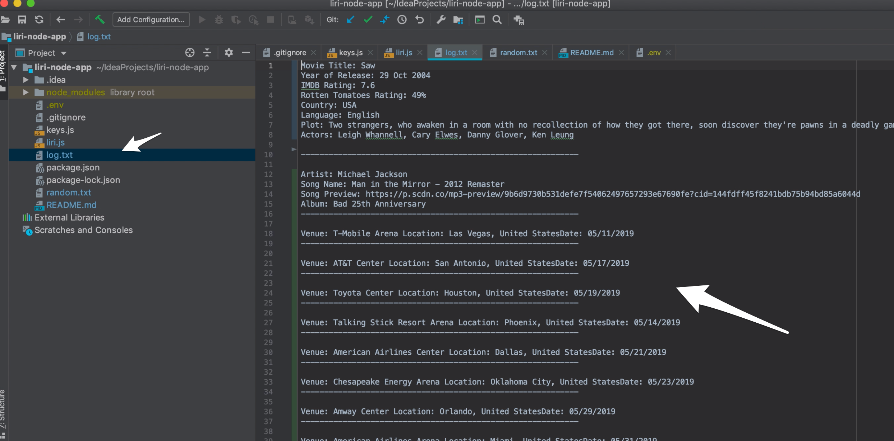

#### 8) Screenshot: Executing command 'do-what-it-says' with spotify-this-song command

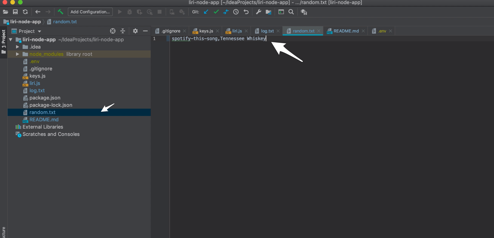

#### 9) Screenshot: Display the log file with the results of do-what-it-says from the random file with spotify-this-song

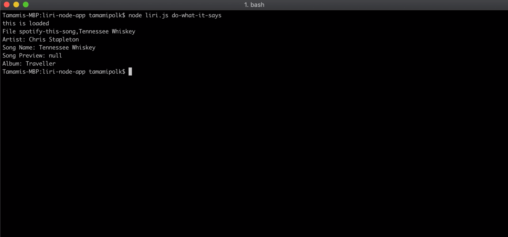

#### 10) Screenshot: Executing command 'do-what-it-says' with movie-this command

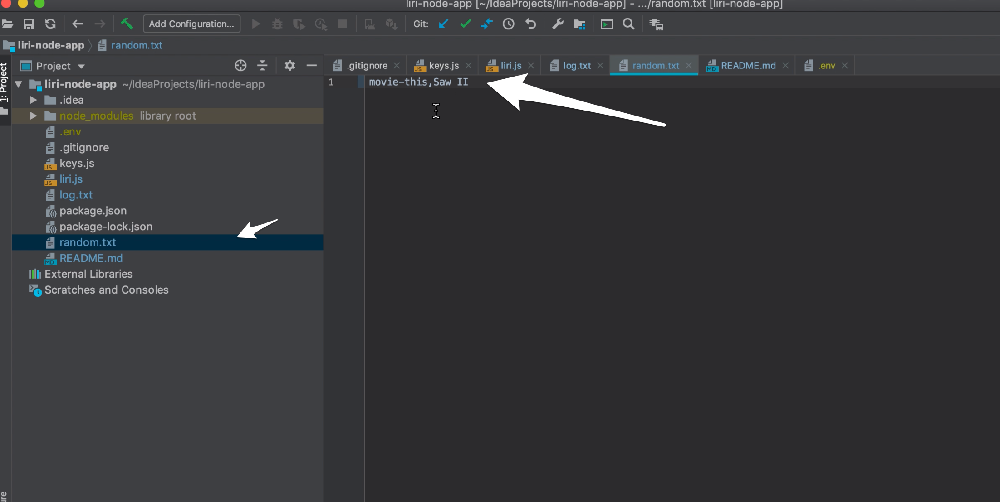

#### 11) Screenshot: Display the log file with the results of do-what-it-says from the random file with movie-this

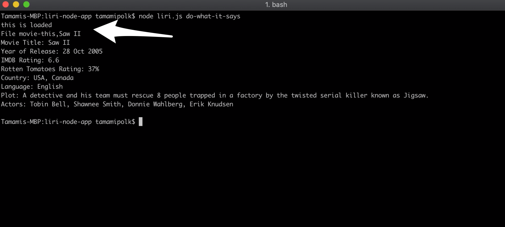

#### 12) Screenshot: Executing command and display for the command 'movie-this' when a movie title is not provided

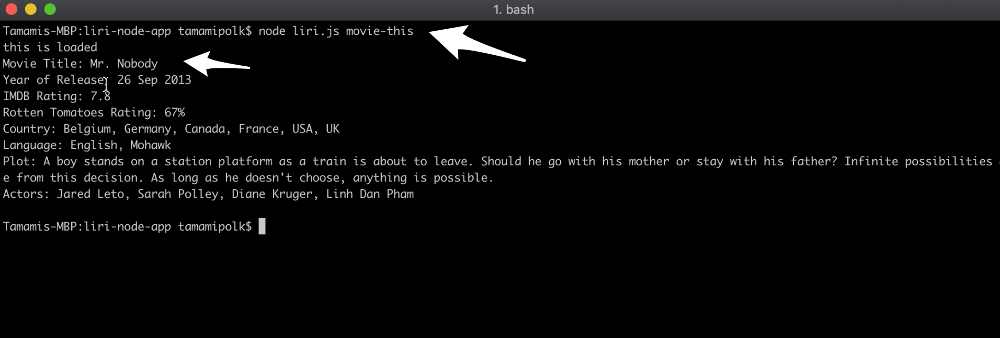

#### 13) Screenshot: Displaying how the results are appended to the end of log file

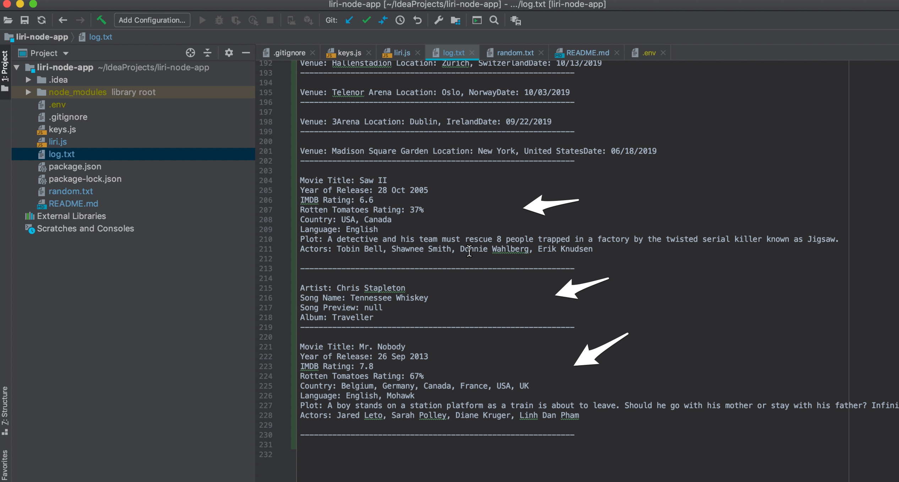

### My Portfolio

I updated My Portfolio to include the LIRI NODE APP.

### Summary

I hope you enjoy the LIRI-NODE-APPLICATION as much as I did building it. 

